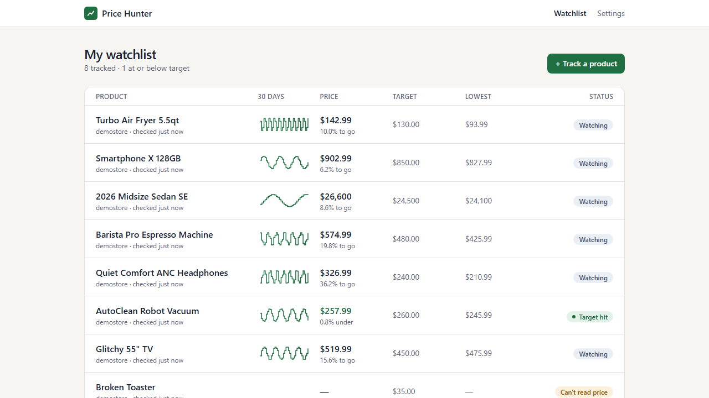

# Price Hunter

Track product prices and get an email when they drop to your target. Written in Go, running serverless on AWS (Lambda, SQS, DynamoDB, EventBridge Scheduler, SES), and defined entirely in Terraform.



```text
MY WATCHLIST
Turbo Air Fryer          $142.99   target $130.00   10.0% to go
AutoClean Robot Vacuum   $257.99   target $260.00   ● Target hit
2026 Midsize Sedan SE    $26,600   target $24,500   8.6% to go
```

## What it does

- Paste a product URL, a target price and a check frequency (hourly to daily).
- A scheduler finds due products, workers fetch the page and extract the price, and price history accumulates.
- When a price reaches the target, you get **one** email. The alert re-arms once the price rises above the target again.
- The watchlist shows status at a glance, each product has a price-history chart, and *Check now* shows live check status.

## Engineering highlights

| | |
|---|---|
| **SSRF-safe fetching of user URLs** | Input validation, plus an IP check at **dial time on every connection and redirect** (defeats DNS rebinding and redirects to metadata endpoints), a 3 MB cap after decompression (gzip bombs), and strict timeouts. ([ADR-007](docs/adr/0007-ssrf-defense-in-depth.md)) |
| **Price extraction that degrades safely** | Strategy chain (schema.org JSON-LD → meta/microdata → per-retailer CSS selectors from YAML). Ambiguous text is rejected instead of guessed. An anomaly gate holds "99% off" glitches until a recheck confirms them. Golden-file tests use saved pages, and failed pages are snapshotted to S3. ([ADR-005](docs/adr/0005-extraction-strategy.md)) |
| **Idempotent, at-least-once pipeline** | Conditional-write idempotency guard per check. Each check commits in one DynamoDB transaction, conditioned on the product's version. A **transactional outbox** turns alerts into email through DynamoDB Streams. Duplicate deliveries produce one price point and one email (tested). ([ADR-004](docs/adr/0004-transactional-outbox.md)) |
| **Failures are data; retries are bounded** | Retailer failures become outcomes with exponential schedule backoff, NEEDS_ATTENTION and GONE states, and a per-domain circuit breaker shared through DynamoDB. Only infrastructure faults reach SQS redelivery, which uses exponential visibility backoff, then the DLQ, then a redrive tool. ([ADR-006](docs/adr/0006-failure-classification-and-rate-limits.md)) |
| **Scheduling without a scheduler service** | A sparse, sharded GSI of `next_check_at`, where `next_check_at` doubles as the lease, so lost messages self-heal within 15 minutes. Queue-depth backpressure. ([ADR-003](docs/adr/0003-database-driven-scheduling.md)) |
| **One codebase, two runtimes** | The same services run as a long-lived server (`pricehunter serve`: API, scheduler ticker, worker pool, graceful drain) and as four thin Lambda adapters. ([ADR-001](docs/adr/0001-lambda-over-fargate.md)) |
| **Infrastructure as code** | Terraform for bootstrap (state, OIDC, budget) and the app (least-privilege IAM per function, JWT-authorized HTTP API, Cognito, CloudFront with a strict CSP, DLQs, alarms), with dev and prod environments. tflint and trivy are clean, with each [accepted exception documented](.trivyignore.yaml). |
| **Observability with an SLO** | JSON logs with correlation IDs. CloudWatch EMF metrics kept deliberately low-cardinality (about 22 series). **SLO: 95% of due checks start within 10 minutes**, measured per product. A dashboard, symptom-based alarms, and a [runbook](docs/runbook.md) entry for each alarm. |
| **CI/CD** | Lint, race-detector tests, fuzzing, integration tests against DynamoDB Local and ElasticMQ, an OpenAPI contract check, Terraform checks, and security scans. Deploy builds once, smoke-tests dev, and promotes the same artifacts to prod after approval. |

## Measured results

Measured on 2026-10-01. Load and test numbers come from Go server mode with DynamoDB Local and the demo store, so anyone can reproduce them on one machine without an AWS account.

| | Result |
|---|---|
| Tests | **306 test cases across 19 packages pass with `-race`**, including integration suites against DynamoDB Local (with Streams) and ElasticMQ. Combined coverage of `internal/` is **81.9%**. |
| Load test, 2,000 new products | 0 failed creates (p95 197 ms). **All 2,000 priced in 41 s, 48.4 checks/s**, which is the configured 50 req/s per-host politeness limit, not a system ceiling. Zero errors logged. |
| Lambda runtime | Real linux/arm64 binaries for api, worker, streams and demostore ran under the AWS Lambda Runtime Interface Emulator with recorded API Gateway, SQS and DynamoDB Streams events. |
| Static checks | golangci-lint, tflint, actionlint: 0 issues. govulncheck, gitleaks, trivy: clean. |

## Quick start (local, no AWS needed)

```sh
docker compose up -d                       # DynamoDB Local + ElasticMQ
(cd web && npm ci && npm run build)
scripts/dev.sh                             # demo store :8081, app on http://localhost:8088
# optional: 60 days of demo history, from another terminal
PH_ENV=local PH_DYNAMODB_ENDPOINT=http://localhost:8000 PH_ALLOW_LOCALHOST=true go run ./cmd/pricehunter seed
```

Or just extract a price:

```sh
go run ./cmd/pricehunter check "https://books.toscrape.com/catalogue/a-light-in-the-attic_1000/index.html"
# A Light in the Attic — 51.77 GBP (IN_STOCK, books-toscrape via selectors)
```

## Deployment on AWS

Price Hunter runs serverless on AWS, with no VPC, no containers and no always-on compute, so it scales to zero and costs a few dollars a month. Everything is defined in Terraform under `infra/`, with separate `dev` and `prod` environments:

| Layer | Choice |
|---|---|
| Frontend | React SPA on S3 + CloudFront (Origin Access Control, strict CSP) |
| Auth | Cognito (OIDC + PKCE), API Gateway HTTP API with a JWT authorizer and throttling |
| Compute | Go Lambda functions on arm64: api, scheduler, worker, streams |
| Scheduling | EventBridge Scheduler every 5 minutes, fanning out to SQS (with DLQ) |
| Data | DynamoDB single-table design with a sparse sharded GSI, Streams, TTL and PITR |
| Email | SES, driven by a transactional outbox on DynamoDB Streams |
| Observability | JSON logs, CloudWatch EMF metrics, a dashboard, SLO/DLQ/dead-man alarms, a $10/month budget alert |
| Delivery | GitHub Actions with OIDC: deploys to dev on merge, smoke-tests, then promotes the same artifacts to prod after approval |

Bring-up is `infra/bootstrap` once per account, then `scripts/deploy.sh dev`. The full walkthrough is in [docs/deploying.md](docs/deploying.md).

## Architecture

```text
Browser ─► CloudFront/S3 (SPA)      Cognito (OIDC + PKCE)
   │
   └─► API Gateway (JWT) ─► λ api ─────────────┐
                                               ▼
EventBridge (5 min) ─► λ scheduler ─► SQS ─► λ worker ─► retailers
                          │      (DLQ)        │  ▲
                          └──────► DynamoDB ◄─┘  └─ S3 snapshots
                                     │ Streams
                                     ▼
                                λ streams ─► SES ─► email
CloudWatch: JSON logs · EMF metrics · dashboard · SLO/DLQ/dead-man alarms
```

The full diagram and package map are in [docs/architecture.md](docs/architecture.md).

## Repository

```text
cmd/            pricehunter (check|serve|seed|dlq), lambda-*, demostore, smoke, loadtest
internal/       domain · urlx fetch extract retailer · products checker scheduler notify
                store queue api auth · app config lambdax telemetry metrics
api/            openapi.yaml (the contract; responses are validated against it in tests)
web/            React + TypeScript + Vite UI
infra/          bootstrap/ · modules/{lambda-go,app}/ · envs/{dev,prod}/
testdata/       saved product pages + golden results, recorded Lambda events
docs/           architecture, ADRs, runbook, security, deployment
```

## Documentation

- [Architecture decision records](docs/adr/)
- [Security model](docs/security.md) · [Runbook](docs/runbook.md) · [Development](docs/development.md) · [Deploying](docs/deploying.md)

## How I built this

I built Price Hunter using spec-driven development with Claude, which gave me a deliberate and repeatable process. I worked in phases, and each phase followed the same steps. For each part of the system, I first defined the requirement and shaped it into a spec that set out the behavior, the trade-offs, and the direction I wanted, and I refined that spec before any code was written. I then implemented against that spec with Claude, and I reviewed and tested each phase before moving on to the next. The phases ran from the price-extraction core through storage and the API, the tracking loop, the AWS deployment, reliability, notifications, observability and CI/CD.

## Scope and ethics

Price Hunter respects robots.txt, identifies itself with an honest User-Agent, checks no more than hourly, and rate-limits per host. It does not use proxies, solve CAPTCHAs, or evade bot detection. Heavily bot-protected retailers are unsupported by design. The included **demo store** is a fictional retailer for demos, tests and load tests.
