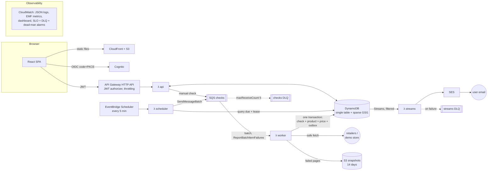

# Architecture

One Go module (a modular monolith) with thin entrypoints, serverless on AWS. There's no VPC, no containers in production, and no microservices.

## Request and check flows

**Track a product.** `POST /v1/products`, then `products.Service.Create`:

1. Validate input and the URL (SSRF layer 1).
2. Resolve the retailer profile and canonicalize the URL.
3. One transaction writes the product, the URL guard, the quota counter and the first QUEUED check.
4. Enqueue the first check. `next_check_at = now + 15m` acts as a lease, so a lost enqueue self-heals.

**Scheduled check.**

1. The scheduler queries the 4 GSI1 shards for `next_check_at ≤ now`, takes a conditional lease on each due product, and enqueues messages in batches of 10.
2. The worker runs `BeginCheck`, the idempotency guard. A duplicate delivery stops here.
3. It checks the circuit breaker, then fetches through the SSRF-safe client.
4. It runs the extractor chain: JSON-LD, then meta/microdata, then selectors.
5. `domain.Policy.Apply`, a pure function, decides the product's next state: price, alert, backoff, status.
6. `CommitCheck` writes everything in one transaction, conditioned on the check being RUNNING and the product being at the version read.

**Alert.** The commit includes a PENDING Notification item (the transactional outbox). DynamoDB Streams invokes `streams`, which claims it (PENDING → SENDING), sends through SES, and records SENT.

## Package map

| Layer | Packages |
|---|---|
| Entrypoints | `cmd/pricehunter` (check · serve · seed · dlq), `cmd/lambda-{api,scheduler,worker,streams,demostore}`, `cmd/smoke`, `cmd/loadtest`, `cmd/demostore` |
| Composition | `internal/app` (builds everything from `internal/config`), `internal/lambdax` (Lambda event adapters) |
| Use cases | `internal/products`, `internal/checker`, `internal/scheduler`, `internal/notify` |
| Domain | `internal/domain`: Money, Product, the check policy and alert state machine (pure, no I/O) |
| Price extraction | `internal/urlx`, `internal/fetch`, `internal/extract`, `internal/retailer` |
| Adapters | `internal/store` (DynamoDB), `internal/queue` (SQS, in-memory, DLQ tools), `internal/snapshot`, `internal/api` (HTTP), `internal/auth` |
| Cross-cutting | `internal/telemetry` (slog, EMF), `internal/metrics` |

Dependencies point inward. `domain` imports nothing from the project, and the use-case packages define the small interfaces they consume.

## Where to read more

- Design decisions: [docs/adr/](adr/)
- Security model: [security.md](security.md) · Operations: [runbook.md](runbook.md) · Deploying: [deploying.md](deploying.md)
